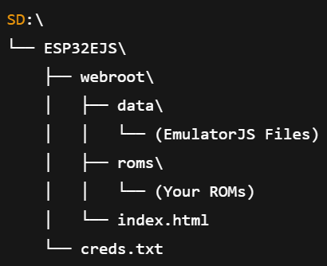
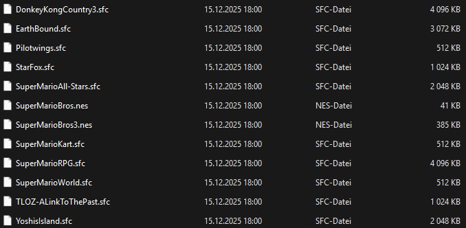
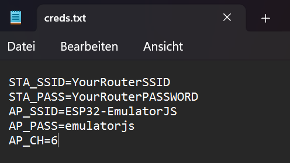
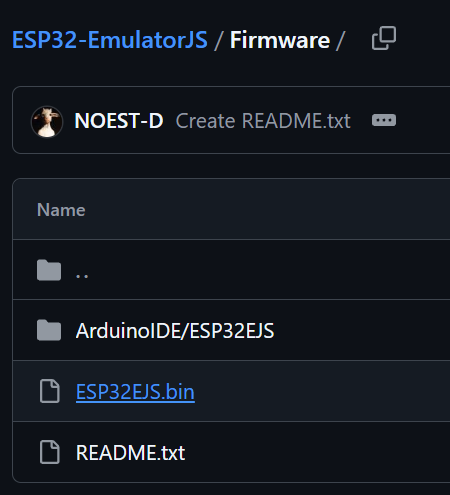
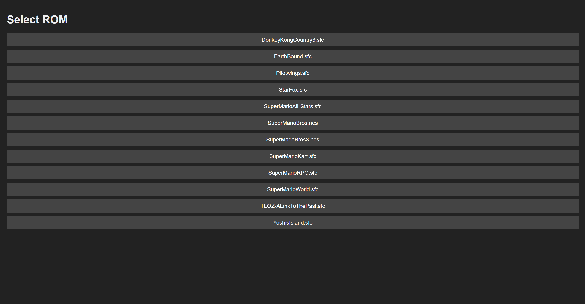
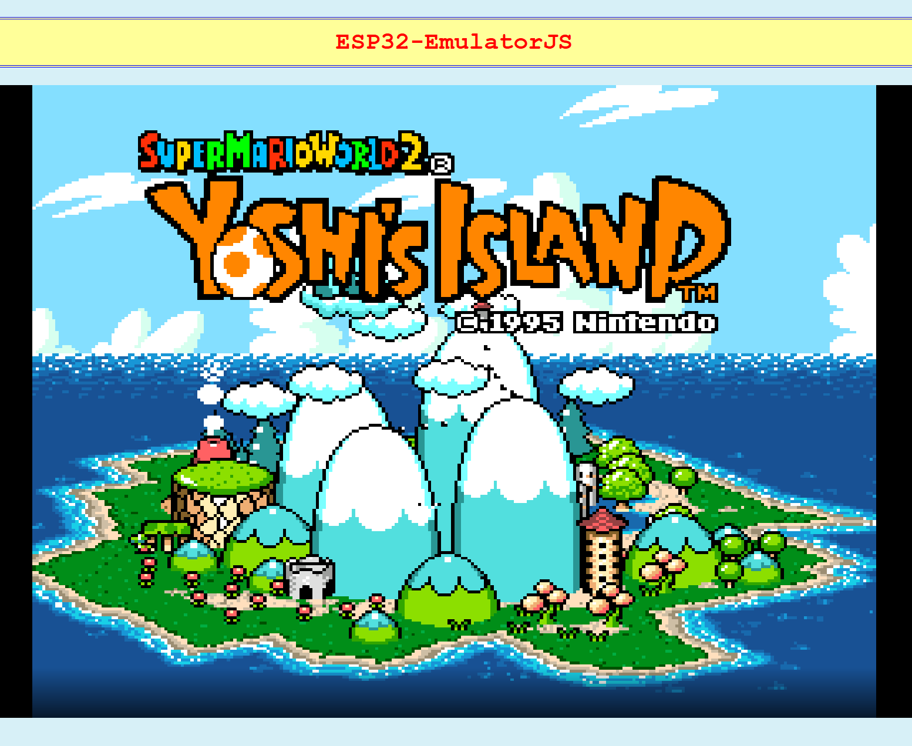
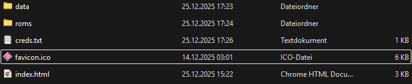

# ESP32-EmulatorJS

A web-based NES and SNES emulator served by the **M5 Cardputer (ESP32)**,  
running locally in the user's browser using **EmulatorJS**.

The ESP32 hosts a web interface and game files, while all emulation is
performed on the client device inside the browser.

---

## Features

- 📟 Designed for the M5 Cardputer (ESP32)
- 🌐 Browser-based NES and SNES emulation
- 🧠 Emulation runs locally in the browser
- 🎮 ROM selection via web UI
- 📦 ROMs stored on the ESP32 (SD)
- ⚡ No emulation performed on the ESP32 itself
- 📱 Works on desktop and mobile browsers

---

## How It Works

1. The ESP32 runs a local web server
2. The user connects to the Cardputer via Wi-Fi
3. A web interface is loaded in the browser
4. The user selects a game from the available ROM list
5. The selected ROM and the emulator files are transferred to the browser
6. The emulator runs **entirely on the client device**

---

## Limitations

- Performance depends on the client device
- Input latency may vary by browser
- Large ROMs may load slowly over Wi-Fi

---

## ROMs and Legal Notice

⚠️ **This repository does NOT include any ROM files.**

ROMs must be:
- Legally obtained
- Dumped from cartridges you own
- Added manually to the ESP32’s filesystem

The ROMs are served **only over the local network** and are never
distributed through this repository.

---

## Setup

| Step | Describtion | Image |
|:----:|-------------|-------|
| 1. | <ul><li>Download the ESP32EJS.zip from the latest release and extract it into your Cardputer's SD root</li></ul> |  |
| 2. | <ul><li>Prepare your legally obtained NES/SNES ROM files and add them to the ESP32 filesystem (SD:\ESP32EJS\webroot\roms\)</li></ul> |  |
| 3. | <ul><li>Add your WiFi Credentials in the creds.txt file (SD:\ESP32EJS\creds.txt)</li><li>The AP credentials are used in Access Point Mode (AP-MODE) in wich the Cardputer hosts its own Wi-Fi</li><li>AP_PASS has to be at least 8 characters long</li></ul> |  |
| 4. | <ul><li>Flash the .bin file from the latest release</li><li>There is also a .ino file under "Firmware/ArduinoIDE/ESP32EJS/" if you want to check out the code</li></ul> |  |
| 5. | <ul><li>Turn on the Cardputer</li><li>For AP-MODE press the G0 button when its prompted on the Cardputer</li></ul> | No Image |
| 6. | <ul><li>Open the device’s IP address in your browser and select a ROM from the web interface</li></ul> |  |
| 7. | <ul><li>The selected ROM will now be executed by EmulatorJS</li></ul> 
**Have fun playing!**
 |  |

- The Cardputer’s screen will turn off after 60 seconds to save power. Press G0 to turn it back on.
---

## Custom Favicon

This project does not include a favicon by default.

If you want, you can add your own `favicon.ico` in the webroot directory (the same directory where `index.html` is).
Browsers will automatically use it when loading the page.

---

## Third-Party Software

This project uses **EmulatorJS**, an open-source web emulator framework.

- EmulatorJS repository:  
  https://github.com/EmulatorJS/EmulatorJS

Please refer to the EmulatorJS license for details.

---

## License

This project is licensed under the **MIT License**.  
See the [LICENSE](LICENSE) file for more information.
